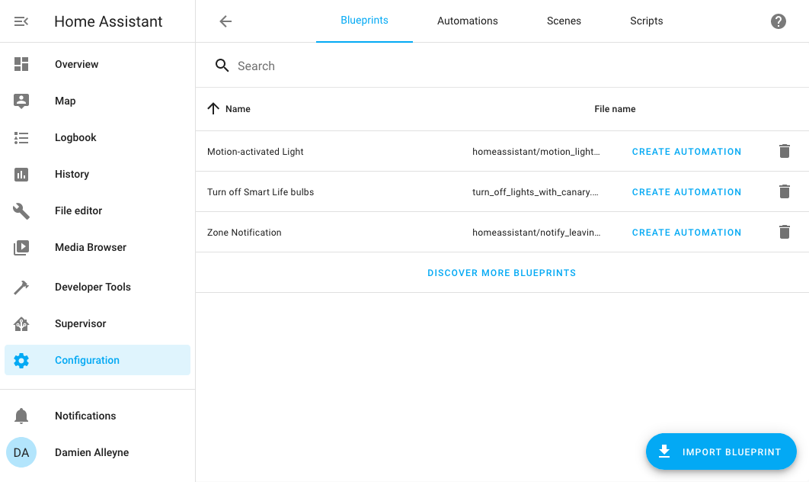
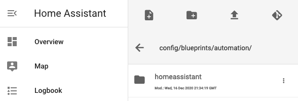
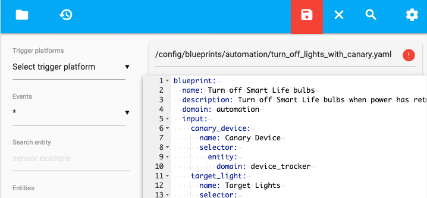

# Home Assistant Blueprints
A repository of custom Home Assistant [Blueprints](https://www.home-assistant.io/docs/automation/using_blueprints/) that I use.

## Installation
This procedure assumes that Home Assistant version 2021.1.5 or newer is installed on your device, and accessed from a Desktop/Laptop browser.

### Easy method
- Copy the URL of the specifc blueprint that you wish to use in this directory.
- Go to `Home Assistant` → `Configuration` → `Blueprints` and click on the blue “Import Blueprint” button in the bottom right.

- Paste the URL in the `URl of the blueprint` field and click on “Preview Blueprint”
- Click on “Import Blueprint”

### Advanced method
- Copy the YAML code of the Blueprint that you wish to use to your clipboard
- Go to Home Assistant → File editor, and click the white folder icon in the top left to browse the file system
- Enter the `/config/blueprints/automation` directory, and create a new file by clicking the New File icon in the top left

- Paste the contents of the clipboard into the file
- Click the red Save icon in the top right

## Blueprints
Before installing any of the below blueprints, insure that the required integrations are installed in Home Assistant, and correctly configured. See [https://www.home-assistant.io/integrations/](https://www.home-assistant.io/integrations/) for more details. Configuration of the required integrations is beyond the scope of this documentation.

| Blueprint | Requirements |
| --------- | --------------------- |
|[Turn off Smart Life bulbs](turn_off_lights_with_canary.yaml)|[Tuya](https://www.home-assistant.io/integrations/tuya/),[Device Tracker](https://www.home-assistant.io/integrations/device_tracker/)|

